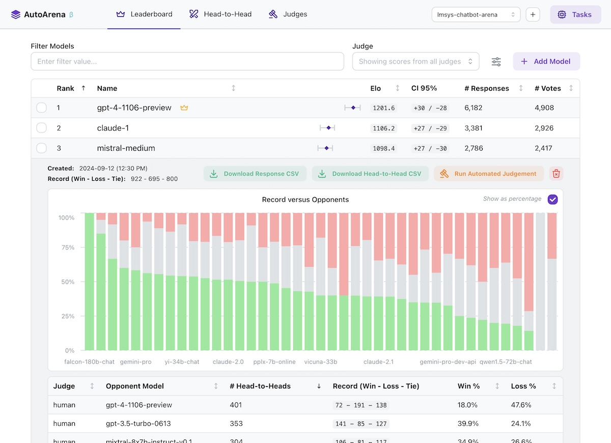

<div align="center">

# AutoArena

**Create leaderboards ranking LLM outputs against one another using automated judge evaluation**

[](https://www.apache.org/licenses/LICENSE-2.0)
[](https://github.com/kolenaIO/autoarena/actions)
[](https://app.codecov.io/gh/kolenaIO/autoarena)
[](https://pypi.python.org/pypi/autoarena)
[](https://pypi.org/project/autoarena)
[](https://kolena-autoarena.slack.com)

</div>

---

- 🏆 Rank outputs from different LLMs, RAG setups, and prompts to find the best configuration of your system
- ⚔️ Perform automated head-to-head evaluation using judges from OpenAI, Anthropic, Cohere, and more
- 🤖 Define and run your own custom judges, connecting to internal services or implementing bespoke logic
- 💻 Run application locally, getting full control over your environment and data

[](https://www.youtube.com/watch?v=GMuQPwo-JdU)

## 🔥 Getting Started

Install from [PyPI](https://pypi.org/project/autoarena/):

```shell
pip install autoarena
```

Run as a module and visit [localhost:8899](http://localhost:8899/) in your browser:

```shell
python -m autoarena
```

With the application running, getting started is simple:

1. Create a project via the UI.
1. Add responses from a model by selecting a CSV file with `prompt` and `response` columns.
1. Configure an automated judge via the UI. Note that most judges require credentials, e.g. `X_API_KEY` in the
   environment where you're running AutoArena.
1. Add responses from a second model to kick off an automated judging task using the judges you configured in the
   previous step to decide which of the models you've uploaded provided a better `response` to a given `prompt`.

That's it! After these steps you're fully set up for automated evaluation on AutoArena.

### 📄 Formatting Your Data

AutoArena requires two pieces of information to test a model: the input `prompt` and corresponding model `response`.

- `prompt`: the inputs to your model. When uploading responses, any other models that have been run on the same prompts
   are matched and evaluated using the automated judges you have configured.
- `response`: the output from your model. Judges decide which of two models produced a better response, given the same
   prompt.

### 📂 Data Storage

Data is stored in `./data/<project>.duckdb` files in the directory where you invoked AutoArena. See
[`data/README.md`](./data/README.md) for more details on data storage in AutoArena.

## 🦾 Development

AutoArena uses [uv](https://github.com/astral-sh/uv) to manage dependencies. To set up this repository for development,
run:

```shell
uv venv && source .venv/bin/activate
uv pip install --all-extras -r pyproject.toml
uv tool run pre-commit install
uv run python3 -m autoarena --dev
```

To run AutoArena for development, you will need to run both the backend and frontend service:

- Backend: `uv run python3 -m autoarena --dev` (the `--dev`/`-d` flag enables automatic service reloading when
    source files change)
- Frontend: see [`ui/README.md`](./ui/README.md)

To build a release tarball in the `./dist` directory:

```shell
./scripts/build.sh
```
